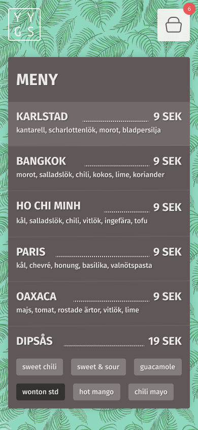
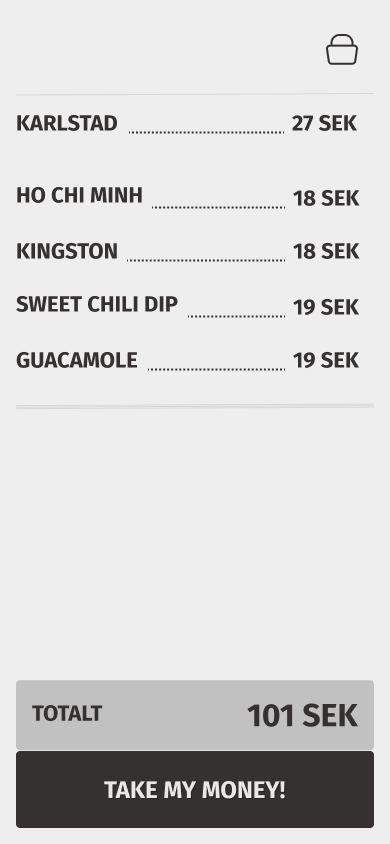
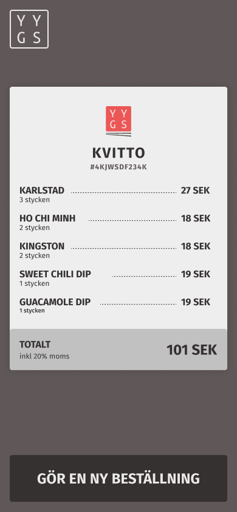

# Yum Yum Gim Mie Sum Foodtruck Project

## Project Overview

The project is a React-based web application designed to facilitate online food ordering. It serves as a platform where users can view menu, add items to their cart and remove them, and place orders, get estimate time of arrival and view receipt.

## Key feature:

- Menu
  

- Order
  

- ETA
  

- Receipt
  

## Installation

Clone the repository:
`git clone https://github.com/your-username/your-repo.git
cd your-repo`
Install dependencies:
`npm install`

## Usage

To start the development server:
`npm start`

For production build:
`npm run build`

## Environment Variables

Create a .env file in the root directory and add the following:
`VITE_API_URL=https://your-api-backend.com
VITE_API_KEY=your_api_key
VITE_API_USER=your_user_id
VITE_APP_TITLE=app_name`

## Technologies Used

### Frontend:

- React: For building the user interface.
- React Router: For navigation and routing.
- Redux: For state management.
- RTK Query: For API calls to the backend

#### Design

[Figma design](https://www.figma.com/design/F4xsg9ohm9DItrp1sRGOtT/Yum-Yum-Gimme-sum---frontend?node-id=1-85&t=CP5YIFXIJVhCFhPZ-0/)

### Backend:

#### API

[Yum Yum Gim Mie Sum Foodtruck API](http://yumyum-assets.s3-website.eu-north-1.amazonaws.com/)

### Other Tools:

- Git/GitHub: For version control.

- Vite: For bundling.

## Folder Structure

`├── packages/       # Packages
│   ├── components/ # Reusable components
│   │   ├──button/  # Button component
│   │   ├──header/  # Header component
│   ├── data/       # Redux store and API handling
│   ├── pages/      # Page components
│   │   ├──menu/    # Menu component 
│   │   ├──order/   # Order component 
│   │   ├──eta      # ETA component
│   │   ├──receipt  # Receipt component
│   ├── router/     # Routing
│   ├── styles/     # Stylesheets
├── public/         # Static assets
├── src/            # Main source code
│   ├── css/        # Stylesheets
├── .env            # .env file
├── .gitignore      # Files to ignore in Git
├── package.json    # Project metadata & dependencies
├── README.md       # Documentation`
